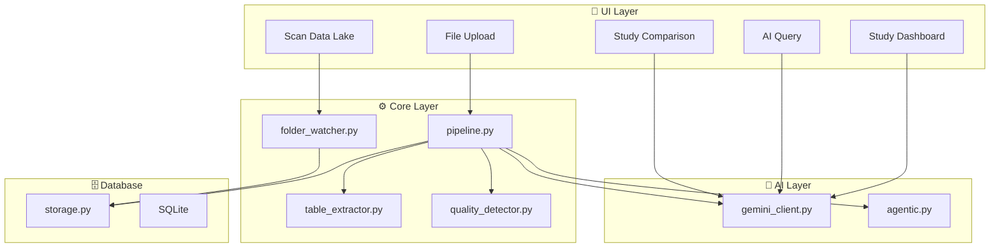

# Clinical Trial Intelligence Platform v2.1 🚀

> **Enterprise-grade clinical trial monitoring powered by Agentic AI**

[](https://github.com/sagar-grv) [](https://www.linkedin.com/in/sagargrv/)

---

## 📖 Project Overview

The **Clinical Trial Intelligence Platform** ingests clinical trial data (Excel), runs advanced analytics to detect risks, and uses **Agentic AI** to propose actionable solutions.

**Key Stats:**

- 🎯 **26 Features** (18 core + 8 new)
- 🏗️ **4 Architectural Layers**
- 🐍 **25+ Python Modules**
- 🤖 **Google Gemini 1.5 (Flash/Pro interchangeable via config)**

---

## Scope Clarification

**This platform IS:**

- ✅ A decision-support and intelligence system
- ✅ Deterministic at its core (rules, scoring, thresholds)
- ✅ AI-augmented for explanation, comparison, and drafting only

**This platform is NOT:**

- ❌ A predictive or forecasting engine
- ❌ A replacement for clinical judgment
- ❌ A live EDC or lab system (integration-ready only)

---

## Dual Maturity Paths

> *This repository contains two maturity paths of the same system:*
>
> **v2.1** demonstrates product breadth and agentic intelligence.
> **v2.0-audit-ready** demonstrates regulatory safety, traceability, and explainability.
>
> *Both share the same conceptual core.*

---

## 🏗️ System Architecture



---

## 🌟 Key Features

### Core Features

| Feature | Description |
|---------|-------------|
| 🛡️ **Trust Layer** | Rule-based evidence for every issue detected |
| ⚡ **Async-Ready Architecture** | Synchronous execution in MVP; worker abstraction included for scale-out |
| 👥 **Role-Based Views** | CTT, CRA, and Site dashboards |
| 📈 **Risk Trends** | Historical risk score tracking |
| 🤖 **Agentic AI** | Human-in-loop email drafting |

### New Features (v2.1) 🆕

| Feature | Description |
|---------|-------------|
| 💬 **AI Query** | Ask natural language questions about your data |
| 🔄 **Cross-Study Comparison** | Side-by-side study analysis with AI |
| 📥 **Human-in-Loop Ingestion** | Auto-detect files with Approve/Skip |
| 🗑️ **Study Delete** | Cascade deletion with confirmation |
| 📋 **Externalized Rules** | YAML-based threshold configuration |

---

## 💻 Tech Stack

| Layer | Technology |
|-------|------------|
| Frontend | Streamlit + Custom CSS |
| Backend | Python, SQLAlchemy |
| Database | SQLite |
| AI Engine | Google Gemini 1.5 (Flash/Pro) |
| Visualization | Plotly |
| Configuration | YAML |

---

## 🚀 Quick Start

```bash
# Clone the repository
git clone https://github.com/sagar-grv/clinical-trial-intelligence-nest2.0.git
cd clinical-trial-intelligence-nest2.0

# Install dependencies
pip install -r requirements.txt

# Run the app
streamlit run app.py
```

Access at: <http://localhost:8501>

---

## 🎬 30-Second Demo Flow

1. **Upload Excel** → Run Intelligence
2. **View risk scores** and trends
3. **Ask AI**: "Which site needs attention?"
4. **Inspect**: "Why am I seeing this?" (Trust Layer)
5. **Approve or reject** an AI-drafted action

---

## ✅ Problem Statement Mapping

| Requirement | Status |
|-------------|--------|
| Siloed Data | ✅ Unified data lake + SQLite |
| Delayed Bottleneck Detection | ✅ Immediate analysis on upload (batch-triggered, API-ready) |
| Inconsistent Data Quality | ✅ YAML rules standardization |
| Manual Processes | ✅ Human-in-loop automation |
| Proactive Detection | ✅ Auto-triggered alerts |
| Generative AI | ✅ Insights, Q&A, Comparison |
| Agentic AI | ✅ Email drafts with approval |

---

## 🔒 Validation Strategy

| Method | Purpose |
|--------|---------|
| **Deterministic Rules** | Verifiable by inspection |
| **Run-Based Snapshots** | Time-travel validation |
| **Validation Mode** | Live DB counters |
| **System Auditor Role** | Independent review capability |
| **AI Grounding** | Prompt facts + hash logging |

---

## 📚 Documentation

| Document | Description |
|----------|-------------|
| [📥 Technical Walkthrough](./docs/walkthrough.md) | Architecture diagrams & function details |
| [📊 Project Analysis](./docs/project_analysis.md) | In-depth review & roadmap |
| [🚀 Deployment Guide](./docs/deployment_guide.md) | GitHub & Streamlit Cloud setup |

---

## 🔮 Roadmap

### Phase 1: Hardening ✅ COMPLETED

- [x] Externalized rules (rules.yaml)
- [x] Human-in-loop ingestion
- [x] Study delete with cascade
- [x] AI Query interface
- [x] Cross-study comparison
- [ ] Unit tests (pytest)
- [ ] PostgreSQL migration

### Phase 2: Enterprise Scale

- [ ] Celery/Redis task queue
- [ ] Audit logging
- [ ] API token cost tracking
- [ ] Email integration (SMTP)

### Phase 3: Advanced Intelligence

- [ ] RAG integration
- [ ] Feedback loop for AI
- [ ] Predictive analytics

---

## 👥 Team Agens

**Team Lead:** Sagar Grv

[](https://github.com/sagar-grv)
[](https://www.linkedin.com/in/sagargrv/)

---

## 📄 License

MIT License. See [LICENSE](LICENSE) for details.

---

## 🆕 Version History

| Version | Date | Changes |
|---------|------|---------|
| v2.1 | Jan 2026 | AI Query, Cross-Study Comparison, Human-in-Loop Ingestion, Study Delete |
| v2.0 | Dec 2025 | Agentic AI, Role-Based Dashboards, Async-Ready Architecture |
| v1.0 | Nov 2025 | Initial release |

---

*Built with ❤️ by Team Agens for the Clinical Trial Intelligence Challenge*
