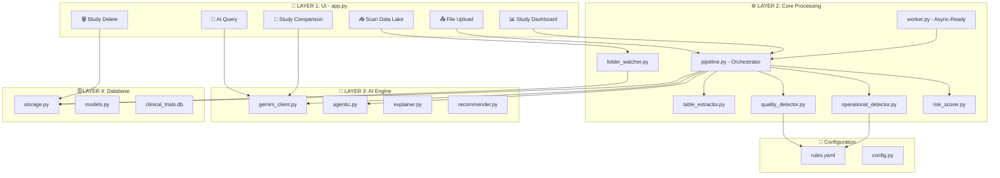
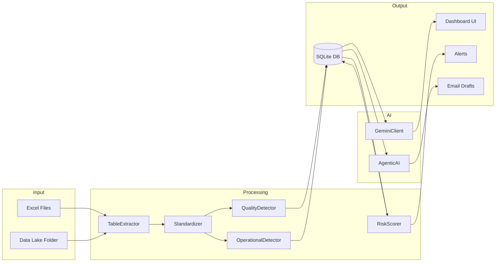
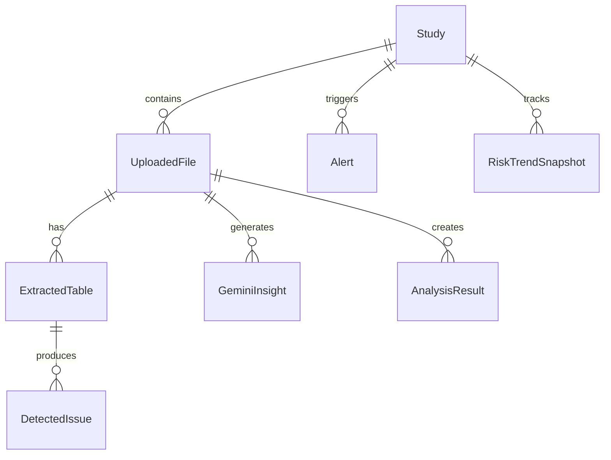

# Clinical Trial Intelligence Platform v2.1 - Technical Walkthrough

## 👥 Team Agens | Lead: Sagar Grv

[](https://github.com/sagar-grv) [](https://www.linkedin.com/in/sagargrv/)

---

## Executive Summary

| Metric | Value |
|--------|-------|
| Total Features | 26 |
| Core Features | 18 |
| New Gap Improvements | 8 |
| Architectural Layers | 4 |
| Python Modules | 25+ |
| AI Engine | Google Gemini 1.5 (Flash/Pro) |

---

## Scope Clarification

**This platform IS:**

- ✅ A decision-support and intelligence system
- ✅ Deterministic at its core (rules, scoring, thresholds)
- ✅ AI-augmented for explanation, comparison, and drafting only

**This platform is NOT:**

- ❌ A predictive or forecasting engine
- ❌ A replacement for clinical judgment
- ❌ A live EDC or lab system (integration-ready only)

---

## System Architecture (4 Layers)



---

## Data Flow Diagram



---

## Layer 1: UI Functions (app.py)

| Function | Purpose | New |
|----------|---------|-----|
| `main()` | Entry point, navigation router | |
| `render_file_upload()` | Manual file upload interface | |
| `render_pending_ingestion()` | Auto-detect files with Approve/Skip | ✅ |
| `render_files_list()` | List uploaded files | |
| `render_studies_list()` | List studies with DELETE button | ✅ |
| `render_study_dashboard()` | 6-tab study analytics view | |
| `render_ai_query_section()` | Natural language Q&A | ✅ |
| `render_study_comparison()` | Side-by-side study comparison | ✅ |

### Dashboard Tabs (Per Role)

| Tab | CTT | CRA | Site |
|-----|-----|-----|------|
| 1 | Strategic Overview | Site Issues | Compliance Status |
| 2 | All Files | Action Items | My Tasks |
| 3 | AI Insights | Monitoring Focus | Submitted Files |
| 4 | 💬 AI Query | 💬 AI Query | 💬 AI Query |
| 5 | 📈 Risk Trends | 📈 Site Trends | 📈 Progress |
| 6 | 🤝 AI Actions | 🤝 AI Actions | 🤝 AI Actions |

---

## Layer 2: Core Processing Functions

### pipeline.py (Orchestrator)

| Function | Purpose |
|----------|---------|
| `process_file()` | Main file processing pipeline |
| `analyze_study()` | Run all detectors on study |
| `generate_study_insights()` | Trigger AI analysis |
| `_detect_quality_issues()` | Call quality detector |
| `_detect_operational_issues()` | Call operational detector |
| `_calculate_risk()` | Compute risk score |

### folder_watcher.py (NEW)

| Function | Purpose |
|----------|---------|
| `scan_for_new_files()` | Detect new Excel files in data lake |
| `process_file()` | Process approved file |
| `skip_file()` | Mark file as skipped |
| `resume_interrupted()` | Resume failed uploads |
| `get_pending_files()` | List files awaiting approval |

### Detection Modules

| Module | Rules |
|--------|-------|
| `quality_detector.py` | MISSING_DATA, MISSING_LAB_DATA, EMPTY_ROWS, MISSING_CRF |
| `operational_detector.py` | QUERY_BACKLOG, DELAYED_VISITS, DATA_ENTRY_DELAY |
| `risk_scorer.py` | Weighted scoring algorithm |

---

## Layer 3: AI Functions

### gemini_client.py

| Function | Prompt Types |
|----------|--------------|
| `generate_insight()` | summary, insight, qa, comparison |
| `_build_prompt()` | Constructs context-aware prompts |
| `answer_question()` | Natural language Q&A |

### agentic.py (Human-in-Loop)

| Function | Purpose |
|----------|---------|
| `draft_query_email()` | Generate email to site about issues |
| `recommend_site_visit()` | Suggest monitoring visits |
| `approve_action()` | Execute approved action |
| `reject_action()` | Log rejection |

---

## Layer 4: Database Functions

### storage.py

| Category | Functions |
|----------|-----------|
| Study | `get_or_create_study()`, `get_study_summary()`, `delete_study()` |
| Files | `save_uploaded_file()`, `get_file_by_id()`, `delete_file()` |
| Issues | `save_detected_issue()`, `get_deduplicated_issues()` |
| Alerts | `create_alert()`, `trigger_alerts_for_issues()` |
| Trends | `save_risk_snapshot()`, `get_risk_trend()` |

### Database Schema



---

## Configuration Layer

### rules.yaml (Externalized Thresholds)

```yaml
quality_rules:
  MISSING_DATA:
    thresholds: {low: 5, medium: 15, high: 30}
  MISSING_LAB_DATA:
    thresholds: {low: 1, medium: 3, high: 10}

operational_rules:
  QUERY_BACKLOG:
    thresholds: {low: 10, medium: 20, high: 50}
  DELAYED_VISITS:
    thresholds: {low: 1, medium: 3, high: 10}
```

---

## Complete Feature Inventory (26 Total)

### Core Features (18)

| # | Feature | Module |
|---|---------|--------|
| 1 | Excel file upload | app.py |
| 2 | Multi-sheet table extraction | table_extractor.py |
| 3 | Identifier standardization | standardizer.py |
| 4 | Data quality detection | quality_detector.py |
| 5 | Operational issue detection | operational_detector.py |
| 6 | Risk scoring algorithm | risk_scorer.py |
| 7 | Risk trend tracking | storage.py |
| 8 | Study-level aggregation | pipeline.py |
| 9 | Issue de-duplication | storage.py |
| 10 | Role-based dashboards | app.py |
| 11 | Gemini AI insights | gemini_client.py |
| 12 | Agentic email drafting | agentic.py |
| 13 | Site visit recommendations | agentic.py |
| 14 | Alert system | storage.py |
| 15 | Async background processing | worker.py |
| 16 | Result caching | storage.py |
| 17 | Plotly trend charts | app.py |
| 18 | Trust layer (rule evidence) | explainer.py |

### New Features (8)

| # | Feature | Module |
|---|---------|--------|
| 19 | Externalized rules (YAML) | rules.yaml |
| 20 | Folder watcher | folder_watcher.py |
| 21 | Human-in-loop ingestion | app.py |
| 22 | Resume interrupted uploads | folder_watcher.py |
| 23 | Study delete with cascade | storage.py |
| 24 | AI natural language query | app.py |
| 25 | Cross-study comparison | app.py |
| 26 | AI comparison analysis | gemini_client.py |

---

## Problem Statement Mapping

| Requirement | Status | Implementation |
|-------------|--------|----------------|
| Siloed Data | ✅ Solved | Unified data lake + centralized SQLite |
| Delayed Bottleneck ID | ✅ Solved | Real-time detection on upload |
| Inconsistent Quality | ✅ Solved | Standardized rules in YAML |
| Manual Processes | ✅ Improved | Human-in-loop auto-ingestion |
| Near Real-Time Ingestion | ✅ Improved | Folder watcher |
| Advanced Analytics | ✅ Solved | Risk scoring, trends, comparison |
| Proactive Detection | ✅ Solved | Auto-triggered alerts |
| GenAI - Collaboration | ✅ Solved | AI Query section |
| GenAI - Automation | ✅ Solved | Agentic email drafts |
| GenAI - Context-Aware | ✅ Improved | Cross-study comparison |

---

## How to Run

```bash
cd "clinical final both/New folder - Copy"
streamlit run app.py
```

Access at: <http://localhost:8501>

---

## 🎬 30-Second Demo Flow

1. **Upload Excel** → Run Intelligence
2. **View risk scores** and trends
3. **Ask AI**: "Which site needs attention?"
4. **Inspect**: "Why am I seeing this?" (Trust Layer)
5. **Approve or reject** an AI-drafted action

---

## 🔒 Validation Strategy

| Method | Purpose |
|--------|---------|
| Deterministic Rules | Verifiable by inspection |
| Run-Based Snapshots | Time-travel validation |
| Validation Mode | Live DB counters |
| System Auditor Role | Independent review capability |
| AI Grounding | Prompt facts + hash logging |

---

## Verification Status

| Feature | Status |
|---------|--------|
| Core Pipeline | ✅ Verified |
| Role Logic | ✅ Verified |
| Async-Ready Worker | ✅ Verified |
| AI Query | ✅ Implemented |
| Study Comparison | ✅ Implemented |
| Folder Watcher | ✅ Implemented |
| Study Delete | ✅ Implemented |
| Team Info Display | ✅ Verified |

---

*Built with ❤️ by Team Agens*
