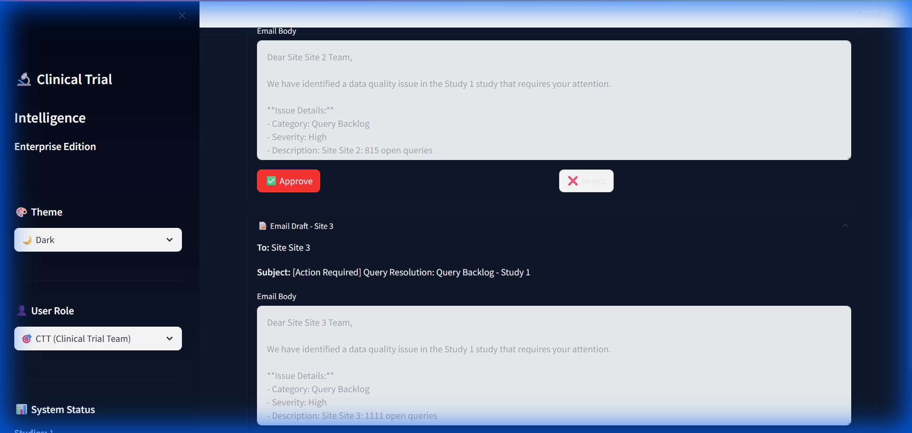

# Clinical Trial Intelligence Platform - Enterprise Edition

## Project Overview

The **Clinical Trial Intelligence Platform** is an enterprise-grade system designed to ingest, analyze, and monitor clinical trial data (Excel-based) for risks, compliance issues, and operational bottlenecks. It emphasizes **Trust** (explainable AI), **Safety** (proactive alerts), **Efficiency** (Agentic AI), and **Performance** (asynchronous processing).

## 🏗️ Key Architecture Pillars

### 1. Trust & Explainability Layer (Proof Layer)

We moved beyond "black box" AI. Every issue detected is backed by deterministic **Rule Evidence**.

- **Rule ID**: Unique identifier for the logic (e.g., `MISSING_LAB_DATA`, `QUERY_BACKLOG`).
- **Trigger**: The exact condition that failed (e.g., `missing_pct > 5%`).
- **Data Proof**: The actual value vs. the threshold (e.g., `Actual: 12% | Threshold: 5%`).
- **Confidence Badges**:
  - ✅ **Rule-Verified**: 100% deterministic code logic.
  - ⚠️ **AI-Explained**: Generative insights (advisory).

### 2. Role-Based Strategy

The UI adapts to the user's persona, ensuring relevant data is strictly scoped:

- **🎯 CTT (Clinical Trial Team)**: Strategic overview, high-level risk scores, cross-study trends.
- **🔍 CRA (Monitor)**: Site-specific issues, visit backlogs, action items.
- **🏥 Site User**: Compliance score, specific tasks to resolve, simplified view.


### 3. Agentic AI (Human-in-the-Loop)

The system doesn't just find problems; it proposes solutions.

- **"AI Proposes, Human Approves"**: The AI drafts emails and recommendations but takes NO action without explicit approval.
- **Capabilities**:
  - 📧 **Draft Query Resolution Emails**: Auto-generates polite, context-aware emails to sites about specific issues.
  - 🏥 **Site Visit Recommendations**: Analyzes issue density to suggest priority monitoring visits.
- **Workflow**: Generate Draft -> User Review -> Approve/Reject -> Execute (Simulated).



### 4. Safety & Trends

- **Active Alerts**: Automatically triggered when risks cross thresholds (e.g., "High Risk Study > 15 score").
- **Risk Trends**: Historical snapshots of risk scores over time, visualized with interactive Plotly charts to track if a study is improving or deteriorating.

## 🚀 Performance Architecture (NEW)

To handle large enterprise studies without blocking the UI, we implemented a robust **Async/Cache Architecture**:

1. **Asynchronous Analysis**:
    - Heavy lifting (de-duplication, risk scoring, AI insights) runs in a background thread (`AnalysisWorker`).
    - The UI remains responsive, showing a live "Analysis in Progress" status bar.

2. **Smart Caching**:
    - Analysis results are serialized and stored in the database (`Study.cached_analytics`).
    - Subsequent page loads are **instant** (O(1) lookup), serving data directly from cache instead of re-computing.

3. **Lazy Loading & Pagination**:
    - **Pagination**: Issues tables now support server-side pagination (50 rows/page), enabling the review of thousands of issues without browser lag.
    - **On-Demand Details**: Heavy file details and drill-downs are loaded only when requested.

## 💻 Tech Stack

- **Frontend**: Streamlit (Python) with Custom CSS Themes (Light/Dark/Blue).
- **Backend**: Python, SQLite, SQLAlchemy.
- **AI**: Google Gemini Pro (via `GeminiClient`).
- **Visualization**: Plotly Interactive Charts.
- **Processing**: Pandas, OpenPyXL, Threading.

## 🏃 How to Run

1. **Start the Application**:

   ```bash
   streamlit run app.py
   ```

2. **Workflow**:
   - **Upload**: Go to "Upload", create a study (e.g., "Study A"), and drop Excel files.
   - **Wait (Async)**: Watch the background analysis complete.
   - **Dashboard**: Navigate to "All Studies" -> Select "Study A".
   - **Review**: Switch roles (CTT/CRA) to see different views.
   - **Act**: Go to "Agentic AI" tab -> Generate Email Drafts -> Approve.

## ✅ Verification Status

- **Core Pipeline**: Verified.
- **Role Logic**: Verified.
- **Async Worker**: Verified (Logs confirm successful background execution).
- **Pagination**: Implemented and Code-Verified.
